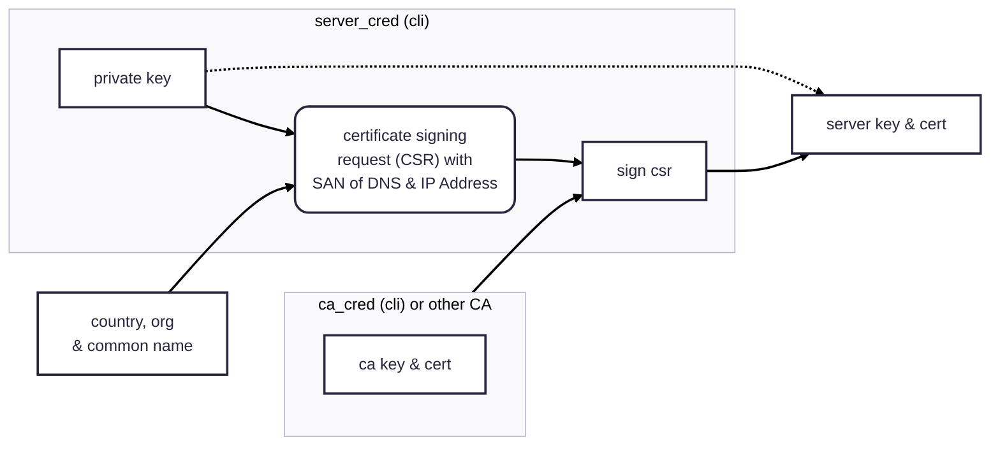
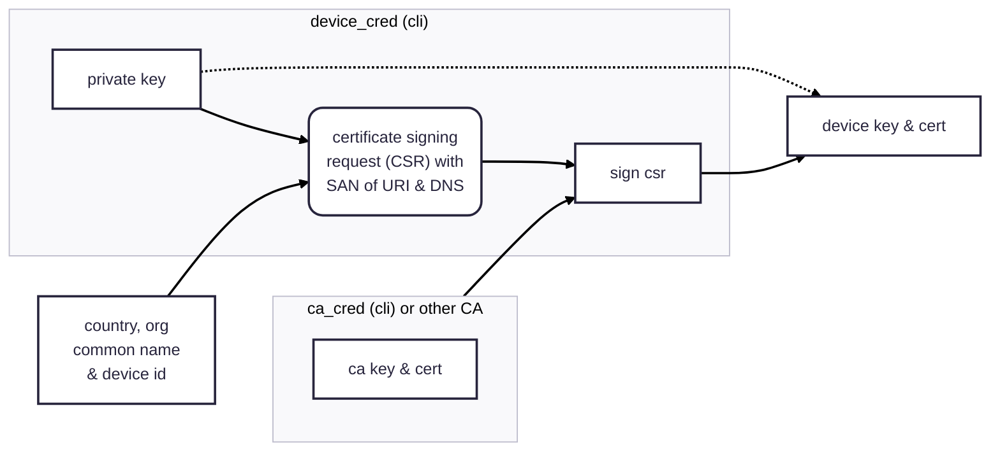

# Contributed Plugins

Plugins that are not part of the core functionality of the aMQTT broker or client, often requiring additional dependencies:

```shell
$ pip install amqtt[contrib]
```

## Authentication Using Signed Certificates 

### Quick start

Generate a self-signed root credentials and server credentials:

```shell
$ ca_creds --country US --state NY --locality NY --org-name "My Org's Name" --cn "my.domain.name"
$ server_creds --country US --org-name "My Org's Name" --cn "my.domain.name"
```

!!! warning "Security of private keys"
    Your root credential private key and your server key should *never* be shared with anyone. The
    certificates -- specifically the root CA certificate -- is completely safe to share and will need
    to be shared along with device credentials when using a self-signed CA.

Include in your server config:

```yaml
listeners:
  ssl-mqtt:
    bind: "127.0.0.1:8883"
    ssl: true
    certfile: server.crt
    keyfile: server.key
    cafile: ca.crt
plugins:
  amqtt.contrib.cert.CertificateAuthPlugin:
    uri_domain: my.domain.name
```

Generate a device's credentials:

```shell
$ device_creds --country US --org-name "My Org's Name" --device-id myUniqueDeviceId --uri my.domain.name
```

And use these to initialize the `MQTTClient`:


```python
import asyncio
from amqtt.client import MQTTClient

client_config = {
    'keyfile': 'myUniqueDeviceId.key',
    'certfile': 'myUniqueDeviceId.crt',
    'broker': {
        'cafile': 'ca.crt'
    }
}

async def main():
    client = MQTTClient(config=client_config)
    await client.connect("mqtts://my.domain.name:8883")
    # publish messages or subscribe to receive 

asyncio.run(main())
```


::: amqtt.contrib.cert.CertificateAuthPlugin

### Root & Certificate Credentials

The process for generating a server's private key and certificate is only done once. If you have a private key & certificate -- 
such as one from verifying your webserver's domain with LetsEncrypt -- that you want to use, pass them to the `server_creds` cli.
If you'd like to use a self-signed certificate, generate your own CA by running the `ca_creds` cli (make sure your client is 
configured with `check_hostname` as `False`). 



### Device credentials

For each device, create a device id to generate a device-specific private key and certificate using the `device_creds` cli.
Use the same CA as was used for the server (above) so the client & server recognize each other.


### Key and Certificate Generation

::: mkdocs-typer2
    :module: amqtt.scripts.ca_creds
    :name: ca_creds

::: mkdocs-typer2
    :module: amqtt.scripts.server_creds
    :name: server_creds

::: mkdocs-typer2
    :module: amqtt.scripts.device_creds
    :name: device_creds

