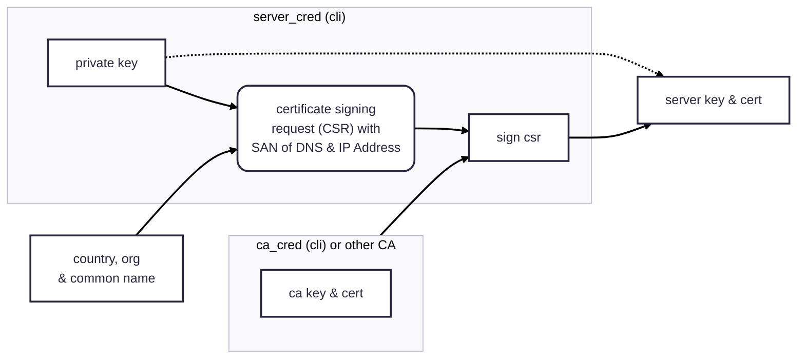
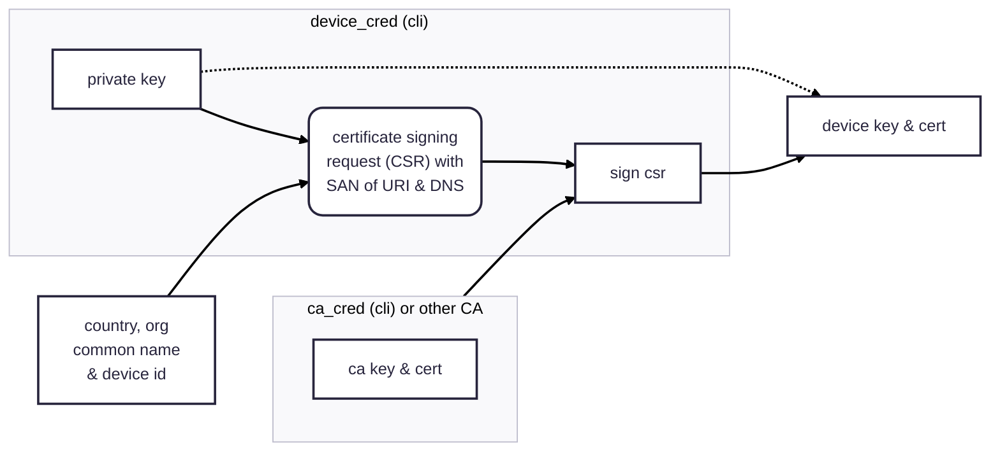

# Contributed Plugins

Plugins that are not part of the core functionality of the aMQTT broker or client, often requiring additional dependencies:

```shell
$ pip install amqtt[contrib]
```

# Authentication Using Signed Certificates 

### Quick start

Generate a self-signed root credentials and server credentials:

```shell
$ ca_creds --country US --state NY --locality NY --org-name "My Org's Name" --cn "my.domain.name"
$ server_creds --country US --org-name "My Org's Name" --cn "my.domain.name"
```

!!! warning "Security of private keys"
    Your root credential private key and your server key should *never* be shared with anyone. The
    certificates -- specifically the root CA certificate -- is completely safe to share and will need
    to be shared along with device credentials when using a self-signed CA.

Include in your server config:

```yaml
listeners:
  ssl-mqtt:
    bind: "127.0.0.1:8883"
    ssl: true
    certfile: server.crt
    keyfile: server.key
    cafile: ca.crt
plugins:
  amqtt.contrib.cert.CertificateAuthPlugin:
    uri_domain: my.domain.name
```

Generate a device's credentials:

```shell
$ device_creds --country US --org-name "My Org's Name" --device-id myUniqueDeviceId --uri my.domain.name
```

And use these to initialize the `MQTTClient`:

```python
import asyncio
from amqtt.client import MQTTClient

client_config = {
    'keyfile': 'myUniqueDeviceId.key',
    'certfile': 'myUniqueDeviceId.crt',
    'broker': {
        'cafile': 'ca.crt'
    }
}

async def main():
    client = MQTTClient(config=client_config)
    await client.connect("mqtts://my.domain.name:8883")
    # publish messages or subscribe to receive 

asyncio.run(main())
```
=======
Plugins that are not part of the core functionality of the aMQTT broker or client and require additional dependencies:
>>>>>>> source/0.11.3-rc.1

`$ pip install '.[contrib]'`

<<<<<<< HEAD
::: amqtt.contrib.cert.CertificateAuthPlugin

### Root & Certificate Credentials

The process for generating a server's private key and certificate is only done once. If you have a private key & certificate -- 
such as one from verifying your webserver's domain with LetsEncrypt -- that you want to use, pass them to the `server_creds` cli.
If you'd like to use a self-signed certificate, generate your own CA by running the `ca_creds` cli (make sure your client is 
configured with `check_hostname` as `False`). 



### Device credentials

For each device, create a device id to generate a device-specific private key and certificate using the `device_creds` cli.
Use the same CA as was used for the server (above) so the client & server recognize each other.


### Key and Certificate Generation

::: mkdocs-typer2
    :module: amqtt.scripts.ca_creds
    :name: ca_creds

::: mkdocs-typer2
    :module: amqtt.scripts.server_creds
    :name: server_creds

::: mkdocs-typer2
    :module: amqtt.scripts.device_creds
    :name: device_creds
=======
# Relational Database for Authentication and Authorization

- `amqtt.contrib.auth_db.AuthUserDBPlugin` (authentication) verify a client's ability to connect to broker
- `amqtt.contrib.auth_db.AuthTopicDBPlugine` (authorization) determine a client's access to topics  

Relational database access is supported using SQLAlchemy so MySQL, MariaDB, Postgres and SQLite support is available.

For ease of use, the [`user_mgr` command-line utility](contrib_plugins.md/#user_mgr) to add, remove, update and 
list clients. And the [`topic_mgr` command-line utility](contrib_plugins.md/#user_topic) to add client access to
subscribe, publish and receive messages on topics.

## Authentication Configuration

::: amqtt.contrib.auth_db.UserAuthDBPlugin.Config

## Authorization Configuration

::: amqtt.contrib.auth_db.TopicAuthDBPlugin.Config

## Command line for authentication

::: mkdocs-typer2
    :module: amqtt.contrib.auth_db.user_mgr_cli
    :name: user_mgr

## Command line for authorization

::: mkdocs-typer2
    :module: amqtt.contrib.auth_db.topic_mgr_cli
    :name: topic_mgr

# Authentication & Topic Access via external HTTP server

`amqtt.contrib.http.HttpAuthTopicPlugin`

If clients accessing the broker are managed by another application, implement API endpoints
that allows the broker to check if a client is authenticated and what topics that client
is authorized to access.

**Configuration**

- `host` *(str) hostname of the server for the auth & acl check
- `port` *(int) port of the server for the auth & acl check
- `user_uri` *(str) uri of the user auth check (e.g. '/user')
- `topic_uri` *(str) uri of the topic check (e.g. '/acl')
- `request_method` *(RequestMethod) send the request as a GET, POST or PUT
- `params_mode` *(ParamsMode) send the request with json or form data
- `response_mode` *(ResponseMode) expected response from the auth/acl server. STATUS (code), JSON, or TEXT.
- `user_agent` *(str) the 'User-Agent' header sent along with the request

Each endpoint (uri) will receive the information needed to determine authentication and authorization (in either
json or form data format, based on the `params_mode`)

For user authentication (`user_uri`), the http server will receive in json or form format the following:
    - username *(str)*
    - password *(str)*
    - client_id *(str)*

For superuser validation (`superuser_uri`), the http server will receive in json or form format the following:
    - username *(str)*

For acl check (`acl_uri`), the http server will receive in json or form format the following:
    - username *(str)*
    - client_id *(str)*
    - topic *(str)*
    - acc *(int)* client can receive (1), can publish(2), can receive & publish (3) and can subscribe (4)


The HTTP endpoints can respond in three different ways, depending on `response_mode`:

1. STATUS - allowing access should respond with a 2xx status code. rejection is 4xx. 
    if a 5xx is received, the plugin will not participate in the filtering operation and will defer to another topic filtering plugin to determine access
2. JSON - response should be `{'ok':true|false|null, 'error':'optional reason for false or null response'}`.
   `true` allows access, `false` denies access and `null` the plugin will not participate in the filtering operation
3. TEXT - `ok` allows access, any other message denies access. non-participation not supported with this mode.
